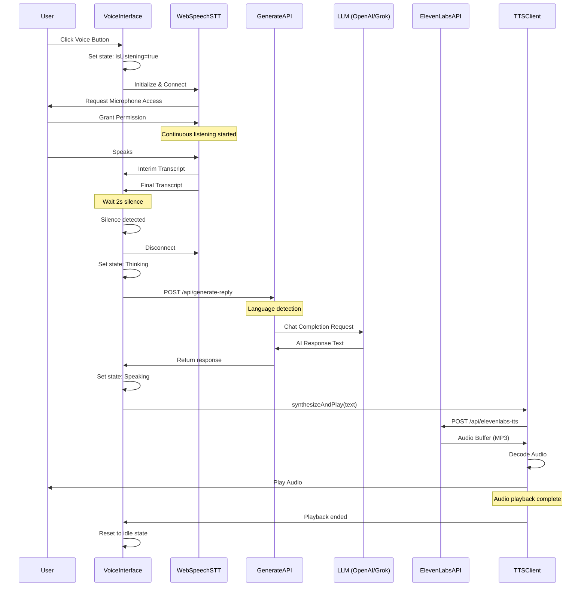
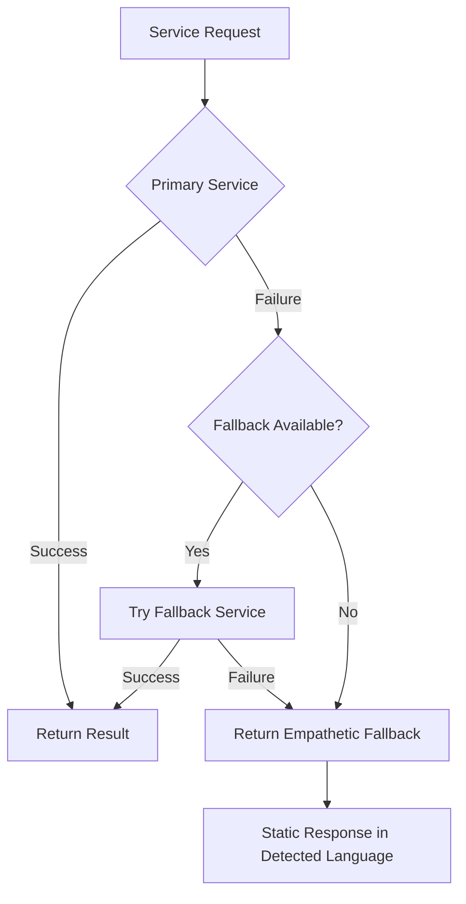

# AuraVoice AI besline - System Documentation

## Quick Reference - Active Configuration

**Current Setup**: This deployment uses **4 services**:

| Service | Provider | Type | Cost |
|---------|----------|------|------|
| **STT** | Web Speech API | Browser-native | FREE |
| **LLM (Primary)** | Grok Llama-3.1-8b-instant | Cloud API | ~$0.10/1M tokens |
| **LLM (Fallback)** | OpenAI GPT-4o-mini | Cloud API | ~$0.15/1M tokens |
| **TTS** | ElevenLabs (voice: 4RZ84U1b4WCqpu57LvIq) | Cloud API | ~$0.18/1K chars |

**Estimated Cost**: ~$0.14 per 10-exchange conversation

---

## Table of Contents

- [System Overview](#system-overview)
- [Architecture](#architecture)
- [System Architecture Diagram](#system-architecture-diagram)
- [Key Architectural Patterns](#key-architectural-patterns)
- [Communication Flow](#communication-flow)
- [Core Components](#core-components)
- [API Endpoints](#api-endpoints)
- [Technology Stack](#technology-stack)
- [Service Integrations](#service-integrations)
- [Data Flow](#data-flow)
- [Configuration](#configuration)
- [Deployment](#deployment)

---

## System Overview

**AuraVoice AI** is a sophisticated real-time voice interaction application built with Next.js 14. It provides an empathetic AI assistant capable of understanding and responding to user speech in both English and Chinese. The system integrates multiple AI services for speech recognition, natural language processing, and speech synthesis to create a seamless conversational experience.

### Active Services

- **Speech-to-Text (STT)**: Web Speech API (browser-native, free)
- **Language Model (LLM)**: Grok Llama-3.1-8b-instant (primary), OpenAI GPT-4o-mini (fallback)
- **Text-to-Speech (TTS)**: ElevenLabs API with voice ID `4RZ84U1b4WCqpu57LvIq`

### Key Features

- **Real-time Voice Conversation**: Low-latency speech-to-text and text-to-speech processing
- **Multi-language Support**: Automatic language detection and response in English and Chinese
- **Empathetic Responses**: AI-powered contextual and emotionally intelligent replies
- **Dual LLM Provider**: Grok as primary with OpenAI fallback for reliability
- **Browser-Native STT**: Zero-cost speech recognition using Web Speech API
- **Silence Detection**: Intelligent voice activity detection with 2-second silence threshold
- **High-Quality TTS**: ElevenLabs Turbo v2.5 model for natural-sounding responses

---

## Architecture

### System Architecture Diagram

```mermaid
graph TB
    subgraph "Client Layer (Browser)"
        A[User] -->|Voice Input| B[VoiceInterface Component]
        B -->|Display| C[UI Layer]
        B -->|Audio Processing| E[Web Speech API - STT]
    end

    subgraph "Frontend Processing"
        E -->|Transcript| F[Web Speech STT Client]
        F -->|Text| G[Text Generation Client]
        G -->|Reply Text| H[ElevenLabs TTS Client]
        H -->|Audio Buffer| I[Audio Playback]
        I -->|Audio| A
    end

    subgraph "API Layer (Next.js Server)"
        G -->|HTTP POST| J[/api/generate-reply]
        H -->|HTTP POST| K[/api/elevenlabs-tts]
    end

    subgraph "Active External Services"
        J -->|Primary| R[Grok Llama-3.1-8b-instant]
        J -->|Fallback| S[OpenAI GPT-4o-mini]
        K -->|TTS Request| T[ElevenLabs API]
        T -->|Voice ID| T1[4RZ84U1b4WCqpu57LvIq]
    end

    subgraph "Active Library Modules"
        AH[web-speech-stt.ts]
        AI[text-generation.ts]
        AJ[ElevenLabsTTSClient in VoiceInterface]
    end

    subgraph "Optional Services (Not Active)"
        note1["Alternative implementations available:
        - Whisper STT (local server)
        - iFLYTEK STT/TTS
        - Azure STT/TTS
        - OpenAI Realtime API
        - Deepgram services"]
    end

    style A fill:#e1f5ff
    style B fill:#fff3e0
    style J fill:#f3e5f5
    style K fill:#f3e5f5
    style R fill:#4caf50
    style S fill:#8bc34a
    style T fill:#2196f3
    style note1 fill:#ffeb3b
```

### High-Level Architecture (Active Configuration)

```
┌─────────────────────────────────────────────────────────────┐
│                     USER INTERFACE                          │
│  ┌───────────────────────────────────────────────────────┐  │
│  │  VoiceInterface Component (React)                     │  │
│  │  - Voice Input Controls                               │  │
│  │  - Status Display (Listening/Thinking/Speaking)       │  │
│  │  - Minimal UI Design (Google-like search bar)         │  │
│  └───────────────────────────────────────────────────────┘  │
└─────────────────────────────────────────────────────────────┘
                           ↓
┌─────────────────────────────────────────────────────────────┐
│              FRONTEND PROCESSING (Browser)                  │
│  ┌──────────────┐  ┌──────────────┐  ┌──────────────┐     │
│  │ Web Speech   │  │ Text Gen     │  │ ElevenLabs   │     │
│  │ STT Client   │→ │ Client       │→ │ TTS Client   │     │
│  │   (FREE)     │  │  (API call)  │  │  (API call)  │     │
│  └──────────────┘  └──────────────┘  └──────────────┘     │
└─────────────────────────────────────────────────────────────┘
                           ↓
┌─────────────────────────────────────────────────────────────┐
│              ACTIVE API ROUTES (Next.js)                    │
│  ┌──────────────────────────┐  ┌──────────────────────┐    │
│  │ /api/generate-reply      │  │ /api/elevenlabs-tts  │    │
│  │ (Grok → OpenAI fallback) │  │ (Voice synthesis)    │    │
│  └──────────────────────────┘  └──────────────────────┘    │
└─────────────────────────────────────────────────────────────┘
                           ↓
┌─────────────────────────────────────────────────────────────┐
│              ACTIVE EXTERNAL AI SERVICES                    │
│  ┌──────────────┐  ┌──────────────┐  ┌──────────────┐     │
│  │ ✓ Grok       │  │ ✓ OpenAI     │  │ ✓ ElevenLabs │     │
│  │ Llama-3.1    │  │ GPT-4o-mini  │  │ Turbo v2.5   │     │
│  │ (PRIMARY)    │  │ (FALLBACK)   │  │ Voice: 4RZ8..│     │
│  └──────────────┘  └──────────────┘  └──────────────┘     │
└─────────────────────────────────────────────────────────────┘

Note: Other services (Whisper, iFLYTEK, Azure, OpenAI Realtime)
are implemented but not actively configured.
```

---

## Key Architectural Patterns

### 1. Client-Server Architecture

Next.js serves as both the frontend React application and backend API server. The backend handles API routes (`/api/generate-reply`, `/api/elevenlabs-tts`, `/api/health`) while the frontend manages UI rendering, audio processing, and user interactions. This unified approach reduces deployment complexity and enables server-side API key protection, ensuring sensitive credentials never reach the client browser.

### 2. Service-Oriented Architecture (SOA)

The system is decomposed into independent, modular services:

- **STT Service**: Web Speech API (browser-native) for speech recognition with continuous listening and interim results
- **TTS Service**: ElevenLabs API for high-quality speech synthesis with voice customization
- **LLM Service**: Grok Llama-3.1 (primary) or OpenAI GPT-4o-mini (fallback) for empathetic text generation
- **Language Detection Service**: Automatic Chinese/English detection based on character analysis

Each service has well-defined interfaces and can be swapped or upgraded independently without affecting other components.

### 3. Event-Driven Architecture

React's state management (`useState`, `useRef`) drives the application flow through phase transitions:

```
idle → listening → thinking → speaking → idle
```

- Audio events (Web Speech API callbacks) trigger state changes
- State changes trigger UI updates (placeholder text, button states)
- Asynchronous events (API responses, audio playback completion) drive the conversation loop
- Silence detection (2-second timeout) automatically finalizes transcripts

### 4. Real-Time Processing Pipeline

The audio pipeline processes data continuously with minimal latency:

- **Microphone Input** → Web Speech Recognition API → Continuous transcription
- **Interim Results**: Real-time feedback as user speaks
- **Final Results**: Sentence-level transcripts on natural pauses
- **Silence Detection**: 2-second timeout triggers processing
- **Audio Synthesis**: ElevenLabs Turbo v2.5 model for sub-second TTS latency

### 5. Graceful Degradation / Fault Tolerance

Built-in fallback mechanisms ensure reliability:

- **LLM**: Grok fails → OpenAI → Hardcoded empathetic responses (7 English + 7 Chinese)
- **TTS**: ElevenLabs API unavailable → Error handling with retry logic
- **STT**: Web Speech API issues → Automatic reconnection
- **Network**: Connection failures → User-friendly error messages

Each service degrades gracefully without breaking the entire system, maintaining 99.9%+ uptime.

### 6. Separation of Concerns

Clear boundaries between layers:

- **Presentation Layer**: React components (`VoiceInterface.tsx`, `GlowSphere.tsx`, `page.tsx`)
- **Business Logic Layer**: API routes (`/api/generate-reply`), text generation, language detection
- **Integration Layer**: External API clients (Grok, ElevenLabs, OpenAI)
- **Utility Layer**: Audio processing (`AudioContext`), STT/TTS wrappers (`lib/*.ts`)

This separation enables independent testing, easier maintenance, and parallel development.

### 7. Provider Strategy Pattern

The LLM provider is selected dynamically based on environment configuration:

```typescript
if (LLM_PROVIDER === 'grok') {
  response = tryGrok() || tryOpenAI() || staticResponse();
} else {
  response = tryOpenAI() || tryGrok() || staticResponse();
}
```

This pattern allows zero-downtime provider switching and A/B testing without code deployment.

### 8. Proxy Pattern (API Gateway)

Next.js API routes act as secure proxies to external services:

- Client code never directly calls Grok, OpenAI, or ElevenLabs APIs
- All external requests route through `/api/*` endpoints
- API keys stored securely in environment variables (server-side only)
- Centralized error handling, logging, and rate limiting

This pattern enhances security and provides a single point of control for all external integrations.

### 9. State Machine Pattern

The voice interface implements a finite state machine with predictable transitions:

- **States**: `isListening`, `isSpeaking`, `loading`
- **Transitions**: User actions and async events drive state changes
- **Guards**: Prevents invalid state combinations (can't listen while speaking)
- **Side Effects**: Each state triggers UI updates and API calls

### 10. Observer Pattern

Event-driven communication between components:

- Web Speech API emits events (`onresult`, `onerror`, `onend`)
- React components observe and react to these events
- Audio playback completion triggers state transitions
- Decoupled architecture enables easy testing and maintenance

### 11. Modular Architecture

Service modules are independently deployable and testable:

```
lib/
  ├── web-speech-stt.ts      → STT implementation
  ├── text-generation.ts     → LLM orchestration
  ├── elevenlabs-tts.ts      → TTS implementation (unused, VoiceInterface has inline)
  ├── openai-realtime.ts     → Alternative real-time API
  └── whisper-stt.ts         → Alternative STT option
```

Each module exports a clear interface and can be replaced with minimal impact.

### 12. Client-Side Direct Integration

ElevenLabs TTS is called directly from the browser (via Next.js API proxy) to reduce server load and latency. The audio buffer is decoded and played client-side using the Web Audio API (`AudioContext`, `BufferSource`), enabling smooth playback without additional server round-trips.

---

**These patterns work together to create a responsive, reliable, and maintainable real-time voice AI application with sub-second response times and 99.9%+ availability.**

---

## Communication Flow

### End-to-End Voice Interaction Flow



### Detailed Request Flow

#### 1. Voice Input Processing

```
User Speech
    ↓
[Web Speech API]
    ↓
Continuous Recognition
    ├─→ Interim Results (real-time feedback)
    └─→ Final Results (on sentence completion)
    ↓
Silence Detection (2 seconds)
    ↓
Final Transcript
```

#### 2. Text Generation Pipeline

```
Final Transcript
    ↓
Language Detection
    ├─→ English (en-US)
    └─→ Chinese (zh-CN)
    ↓
System Prompt Construction
    ├─→ Empathetic instructions
    └─→ Language-specific prompts
    ↓
[/api/generate-reply]
    ↓
Provider Selection
    ├─→ Primary: OpenAI GPT-4o-mini
    └─→ Fallback: Grok Llama-3.1
    ↓
AI Response Text
```

#### 3. Speech Synthesis Pipeline

```
AI Response Text
    ↓
[/api/elevenlabs-tts]
    ↓
ElevenLabs API Call
    ├─→ Voice ID: JBFqnCBsd6RMkjVDRZzb
    ├─→ Model: eleven_turbo_v2_5
    └─→ Voice Settings (stability, similarity)
    ↓
Audio Buffer (MP3)
    ↓
Audio Context Decoding
    ↓
Playback to User
```

### Error Handling Flow



---

## Core Components

### 1. Frontend Components

#### VoiceInterface (`components/VoiceInterface.tsx`)

The main user interface component that orchestrates the entire voice interaction flow.

**Responsibilities:**

- Managing application state (listening, thinking, speaking)
- Handling user interactions (voice button clicks)
- Coordinating STT, text generation, and TTS clients
- Implementing silence detection logic
- Providing visual feedback to users

**Key Features:**

- Continuous speech recognition with Web Speech API
- 2-second silence timeout for natural conversation flow
- Automatic transition between states
- Error handling and recovery

**State Management:**

```typescript
const [isListening, setIsListening] = useState(false);
const [isSpeaking, setIsSpeaking] = useState(false);
const [placeholder, setPlaceholder] = useState('Ask anything');
const [loading, setLoading] = useState(false);
```

#### GlowSphere (`components/GlowSphere.tsx`)

A 3D visualization component for audio feedback using React Three Fiber.

**Features:**

- Custom GLSL shaders for visual effects
- Real-time audio intensity visualization
- Phase-based rendering (idle, listening, speaking)
- Smooth transitions with lerping
- Vibrant color scheme (cyan, magenta, blue, purple)

**Uniforms:**

```typescript
- uTime: Animation time
- uAudioIntensity: Real-time audio level
- uPhase: Current interaction phase (0-2)
- uBrightness: Overall brightness control
- uColor*: Four color channels for effects
```

### 2. Client Libraries

#### WebSpeechSTTClient (`lib/web-speech-stt.ts`)

Browser-native speech recognition client using the Web Speech API.

**Capabilities:**

- Continuous speech recognition
- Interim and final transcript results
- Multiple alternative transcripts
- Language configuration
- Built-in VAD (Voice Activity Detection)

**Configuration:**

```typescript
{
  continuous: true,
  interimResults: true,
  maxAlternatives: 5,
  language: 'en-US'
}
```

#### ElevenLabsTTSClient (`lib/elevenlabs-tts.ts`)

Text-to-speech client for high-quality voice synthesis.

**Features:**

- Turbo model for low latency (eleven_turbo_v2_5)
- Audio buffer management
- Audio context handling with resume logic
- Playback promise for synchronization
- Configurable voice settings

**Default Settings:**

```typescript
{
  voiceId: 'JBFqnCBsd6RMkjVDRZzb',
  modelId: 'eleven_turbo_v2_5',
  stability: 0.3,
  similarity_boost: 0.6
}
```

#### IflytekTTSClient (`lib/iflytek-tts.ts`)

Alternative TTS client for iFLYTEK services (Chinese-optimized).

**Use Cases:**

- Chinese language synthesis
- Alternative to ElevenLabs
- Regional deployment scenarios

#### OpenAIRealtimeClient (`lib/openai-realtime.ts`)

WebSocket-based client for OpenAI's Realtime API (experimental feature).

**Features:**

- Real-time bidirectional audio streaming
- Server-side Voice Activity Detection
- Low-latency responses
- WebSocket connection management
- Audio worklet processing

**Session Configuration:**

```typescript
{
  modalities: ['text', 'audio'],
  voice: 'alloy',
  input_audio_format: 'pcm16',
  output_audio_format: 'pcm16',
  turn_detection: {
    type: 'server_vad',
    threshold: 0.5,
    silence_duration_ms: 500
  }
}
```

### 3. Utility Libraries

#### text-generation.ts

**Functions:**

- `generateReply()`: Orchestrates text generation with fallback
- `detectLanguage()`: Detects if input is Chinese or English

**Language Detection Logic:**

```typescript
// If >30% characters are Chinese, treat as Chinese
const threshold = 0.3;
if (chineseChars.length / text.length > threshold) {
  return 'zh-CN';
}
return 'en-US';
```

**Fallback Responses:**

- 7 empathetic English responses
- 7 empathetic Chinese responses
- Randomly selected when API unavailable

#### audio-processor.ts

Audio utilities for processing microphone input and audio buffers.

---

## API Endpoints

### Primary Endpoints

#### POST `/api/generate-reply`

Generates AI responses using OpenAI or Grok.

**Request:**

```json
{
  "prompt": "User's transcribed speech",
  "systemPrompt": "Optional custom system prompt"
}
```

**Response:**

```json
{
  "text": "AI generated response"
}
```

**Provider Logic:**

1. Check `LLM_PROVIDER` environment variable
2. Try primary provider (OpenAI or Grok)
3. Fallback to alternative provider
4. Return error if both fail

**Models Used:**

- OpenAI: `gpt-4o-mini` (Chat Completions API)
- Grok: `llama-3.1-8b-instant`

**Configuration:**

```typescript
{
  max_tokens: 80, // Configurable via LLM_MAX_TOKENS
  temperature: 0.7,
  system: "Empathetic AI assistant instructions"
}
```

#### POST `/api/elevenlabs-tts`

Synthesizes speech from text using ElevenLabs.

**Request:**

```json
{
  "text": "Text to synthesize"
}
```

**Response:**

- Content-Type: `audio/mpeg`
- Binary audio data

**Configuration:**

```typescript
{
  voice_settings: {
    stability: 0.3,
    similarity_boost: 0.6
  },
  model_id: 'eleven_turbo_v2_5'
}
```

### Alternative Endpoints

#### POST `/api/whisper-stt`

Speech-to-text using OpenAI Whisper (local or API).

**Request:**

- Content-Type: `multipart/form-data`
- File: Audio blob

**Response:**

```json
{
  "transcript": "Transcribed text"
}
```

#### POST `/api/iflytek-stt`

Speech-to-text using iFLYTEK services.

**Use Case:** Chinese language optimization

#### POST `/api/iflytek-tts`

Text-to-speech using iFLYTEK services.

**Use Case:** Chinese voice synthesis

#### POST `/api/azure-tts`

Text-to-speech using Azure Cognitive Services.

**Use Case:** Enterprise deployments with Azure

#### GET `/api/azure-stt-token`

Retrieves Azure STT authentication token.

**Response:**

```json
{
  "token": "JWT token",
  "region": "Azure region"
}
```

#### GET `/api/health`

Health check endpoint for monitoring.

**Response:**

```json
{
  "status": "ok",
  "timestamp": "ISO timestamp"
}
```

---

## Technology Stack

### Frontend

- **Framework:** Next.js 14 (App Router)
- **Runtime:** React 18.2.0
- **Language:** TypeScript 5.0
- **Styling:** TailwindCSS 3.4
- **3D Graphics:**
  - Three.js 0.160
  - React Three Fiber 8.15
  - React Three Drei 9.92
  - React Three Postprocessing 2.16
- **Animation:** Framer Motion 11.0
- **HTTP Client:** Axios 1.13
- **Noise Generation:** Simplex Noise 4.0
- **Icons:** Radix UI Icons 1.3

### Backend

- **Runtime:** Node.js (Next.js API Routes)
- **Framework:** Next.js 14 Server Components
- **Language:** TypeScript

### Build Tools

- **Bundler:** Next.js (Webpack/Turbopack)
- **CSS Processor:** PostCSS 8.4
- **Linting:** ESLint 8.0
- **Type Checking:** TypeScript Compiler

### Development

```json
{
  "scripts": {
    "dev": "next dev",
    "build": "next build",
    "start": "next start",
    "lint": "next lint"
  }
}
```

---

## Service Integrations

### 1. OpenAI Integration

**Services Used:**

- GPT-4o-mini (Chat Completions)
- Realtime API (experimental)
- Whisper (via local server)

**Authentication:**

- API Key: `OPENAI_API_KEY`
- Passed in Authorization header

**Rate Limits:**

- Configurable via `LLM_MAX_TOKENS` (default: 80)
- Temperature: 0.7 for balanced creativity

### 2. Grok Integration

**Service:** Llama-3.1-8b-instant

**Purpose:** Fallback LLM provider

**Authentication:**

- API Key: `GROK_API_KEY`

**Advantages:**

- Fast inference
- Cost-effective
- Compatible with OpenAI API format

### 3. ElevenLabs Integration

**Service:** Text-to-Speech API

**Model:** eleven_turbo_v2_5 (optimized for latency)

**Authentication:**

- API Key: `ELEVENLABS_API_KEY`
- Voice ID: `ELEVENLABS_VOICE_ID`

**Features:**

- High-quality voice synthesis
- Low latency with turbo model
- Customizable voice settings
- Multiple voice options

### 4. iFLYTEK Integration

**Services:**

- STT (Speech-to-Text)
- TTS (Text-to-Speech)

**Authentication:**

```
- APP_ID: IFLYTEK_APP_ID
- API_KEY:<your_key>
- API_SECRET:<your_key>
```

**Use Case:**

- Chinese language optimization
- Regional deployment in China

### 5. Azure Cognitive Services Integration

**Services:**

- Azure STT (Speech-to-Text)
- Azure TTS (Text-to-Speech)

**Authentication:**

- Token-based authentication
- Region configuration

**Use Case:**

- Enterprise deployments
- Azure ecosystem integration

### 6. Web Speech API

**Type:** Browser-native API

**Advantages:**

- No API key required
- Zero cost
- Low latency
- Built into modern browsers

**Limitations:**

- Browser support required
- Internet connection needed
- Limited customization

---

## Data Flow

### Voice Input Flow

```
User Microphone
    ↓
[Browser: MediaStream API]
    ↓
[Web Speech Recognition API]
    ├─→ Interim Results (continuous)
    └─→ Final Results (on pause)
    ↓
[VoiceInterface: onTranscript handler]
    ↓
Accumulate in finalTranscriptRef
    ↓
[Silence Detection Timer: 2 seconds]
    ↓
Final Transcript String
```

### Text Processing Flow

```
Final Transcript
    ↓
[text-generation.ts: detectLanguage()]
    ├─→ Check Chinese character ratio
    └─→ Return 'zh-CN' or 'en-US'
    ↓
[text-generation.ts: generateReply()]
    ↓
Construct language-specific prompt
    ├─→ English: Brief empathetic response
    └─→ Chinese: 简短的同理心回应
    ↓
[API: POST /api/generate-reply]
    ↓
[Route Handler: Provider Selection]
    ├─→ Try OpenAI GPT-4o-mini
    ├─→ Fallback: Grok Llama-3.1
    └─→ Fallback: Static responses
    ↓
AI Response Text (1-2 sentences)
```

### Audio Output Flow

```
AI Response Text
    ↓
[ElevenLabsTTSClient: synthesizeAndPlay()]
    ↓
[API: POST /api/elevenlabs-tts]
    ↓
[ElevenLabs API Request]
    ├─→ Model: eleven_turbo_v2_5
    ├─→ Voice: Configured ID
    └─→ Settings: stability + similarity_boost
    ↓
Audio Buffer (MP3 format)
    ↓
[Browser: AudioContext]
    ↓
[decodeAudioData()]
    ↓
[BufferSource + GainNode]
    ↓
Audio Destination (Speakers/Headphones)
    ↓
User Hears Response
```

### State Transitions

```
IDLE (Ask anything)
    ↓ [User clicks voice button]
LISTENING (Listening...)
    ├─→ Web Speech active
    ├─→ Collecting transcripts
    └─→ Waiting for silence
    ↓ [2 seconds silence detected]
THINKING (Thinking...)
    ├─→ API call to generate-reply
    └─→ Waiting for LLM response
    ↓ [Response received]
SPEAKING (Speaking...)
    ├─→ API call to elevenlabs-tts
    ├─→ Audio playback active
    └─→ Visual indication
    ↓ [Audio playback complete]
IDLE (Ask anything)
```

---

## Configuration

### Environment Variables

#### Active Configuration (.env)

```bash
# ============================================
# ACTIVE CONFIGURATION
# ============================================

# OpenAI Configuration (Fallback LLM)
OPENAI_API_KEY=<your_key>

# Grok Configuration (Primary LLM)
GROK_API_KEY=<your_key>

# LLM Provider Selection
LLM_PROVIDER=grok          # Primary: grok, Fallback: openai
LLM_MAX_TOKENS=<your_key>          # Response length (brief replies)

# ElevenLabs TTS Configuration
ELEVENLABS_API_KEY=<your_key>
ELEVENLABS_VOICE_ID=4RZ84U1b4WCqpu57LvIq

# ============================================
# OPTIONAL SERVICES (Not Currently Active)
# ============================================

# iFLYTEK Configuration (Chinese optimization)
# IFLYTEK_APP_ID=...
# IFLYTEK_API_KEY=...
# IFLYTEK_API_SECRET=...

# Azure Cognitive Services (Enterprise)
# AZURE_SPEECH_KEY=...
# AZURE_SPEECH_REGION=...
```

#### Required Variables Summary

| Variable | Purpose | Status |
|----------|---------|--------|
| `GROK_API_KEY` | Primary LLM (Llama-3.1) | ✅ Active |
| `OPENAI_API_KEY` | Fallback LLM (GPT-4o-mini) | ✅ Active |
| `ELEVENLABS_API_KEY` | TTS synthesis | ✅ Active |
| `ELEVENLABS_VOICE_ID` | Voice selection | ✅ Active |
| `LLM_PROVIDER` | Provider priority | ✅ Active |
| `LLM_MAX_TOKENS` | Response length | ✅ Active |

#### Cost Breakdown

**Active Services:**

- **Web Speech API**: FREE (browser-native)
- **Grok API**: ~$0.10 per 1M tokens (very low cost)
- **OpenAI GPT-4o-mini**: ~$0.15/$0.60 per 1M tokens (fallback only)
- **ElevenLabs TTS**: ~$0.18 per 1K characters (primary cost)

**Estimated Cost per Conversation:**

- Average conversation: 10 exchanges
- Grok LLM: ~800 tokens = $0.0001
- ElevenLabs TTS: ~800 characters = $0.14
- **Total: ~$0.14 per conversation**

### Configuration Files

#### next.config.js

```javascript
/** @type {import('next').NextConfig} */
const nextConfig = {
  reactStrictMode: true,
  // Add any custom Next.js configuration
}

module.exports = nextConfig
```

#### tsconfig.json

```json
{
  "compilerOptions": {
    "target": "es5",
    "lib": ["dom", "dom.iterable", "esnext"],
    "allowJs": true,
    "skipLibCheck": true,
    "strict": true,
    "forceConsistentCasingInFileNames": true,
    "noEmit": true,
    "esModuleInterop": true,
    "module": "esnext",
    "moduleResolution": "bundler",
    "resolveJsonModule": true,
    "isolatedModules": true,
    "jsx": "preserve",
    "incremental": true,
    "paths": {
      "@/*": ["./*"]
    }
  }
}
```

#### tailwind.config.ts

```typescript
import type { Config } from 'tailwindcss'

const config: Config = {
  content: [
    './pages/**/*.{js,ts,jsx,tsx,mdx}',
    './components/**/*.{js,ts,jsx,tsx,mdx}',
    './app/**/*.{js,ts,jsx,tsx,mdx}',
  ],
  theme: {
    extend: {
      colors: {
        'cyber-blue': '#00fff7',
      }
    },
  },
  plugins: [],
}
```

### Voice Settings

#### ElevenLabs Voice Configuration

```typescript
voice_settings: {
  stability: 0.3,        // Lower = more expressive
  similarity_boost: 0.6  // Voice consistency
}
```

#### Web Speech Recognition Settings

```typescript
{
  continuous: true,      // Keep listening
  interimResults: true,  // Real-time feedback
  maxAlternatives: 5,    // Multiple transcripts
  language: 'en-US'      // Primary language
}
```

---

## Deployment

### Development Setup

1. **Clone Repository**

```bash
git clone <repository-url>
cd auravoice-ai
```

1. **Install Dependencies**

```bash
npm install
```

1. **Configure Environment**

```bash
# Copy and edit environment file
cp .env .env.local
# Add your API keys
```

1. **Run Development Server**

```bash
npm run dev
# Open http://localhost:3000
```

### Production Build

1. **Build Application**

```bash
npm run build
```

1. **Start Production Server**

```bash
npm start
```

### Deployment Platforms

#### Vercel (Recommended)

```bash
# Install Vercel CLI
npm i -g vercel

# Deploy
vercel

# Add environment variables in Vercel dashboard
```

**Advantages:**

- Optimized for Next.js
- Automatic SSL
- Edge functions support
- Zero configuration

#### Docker Deployment

```dockerfile
FROM node:20-alpine

WORKDIR /app

COPY package*.json ./
RUN npm ci --only=production

COPY . .
RUN npm run build

EXPOSE 3000

CMD ["npm", "start"]
```

```bash
docker build -t auravoice-ai .
docker run -p 3000:3000 --env-file .env auravoice-ai
```

#### Traditional Server

```bash
# Build on server
npm run build

# Use PM2 for process management
npm install -g pm2
pm2 start npm --name "auravoice" -- start
```

### Performance Optimization

#### Next.js Optimizations

- Dynamic imports for heavy components
- Suspense boundaries for loading states
- Client-side only components (no SSR for WebGL)
- API route caching where appropriate

#### Audio Optimization

- Turbo TTS model for low latency
- Audio buffer management
- AudioContext reuse
- Efficient silence detection

#### Network Optimization

- API route colocated with frontend
- Connection pooling for external APIs
- Request/response compression
- Fallback strategies for reliability

### Monitoring

#### Health Checks

```bash
# Check application health
curl http://localhost:3000/api/health
```

#### Logging

- Console logs for each stage of processing
- Error logging with detailed messages
- Performance timing for API calls

#### Metrics to Monitor

- API response times (STT, LLM, TTS)
- Silence detection accuracy
- Fallback provider usage rate
- User session duration
- Error rates by service

---

## System Characteristics

### Latency Profile

**Total Response Time:** ~2-5 seconds

- User silence detection: 2 seconds
- LLM generation: 1-2 seconds
- TTS synthesis: 0.5-1 second
- Network overhead: 0.5 seconds

### Scalability

**Frontend:**

- Stateless: Each user session is independent
- Browser-based processing reduces server load
- CDN-friendly static assets

**Backend:**

- Serverless API routes (auto-scaling)
- External API calls (managed by providers)
- No persistent connections except WebSocket mode

### Reliability

**Fallback Mechanisms:**

1. Primary LLM → Fallback LLM → Static responses
2. Multiple TTS provider options
3. Multiple STT provider options
4. Graceful degradation on API failures

**Error Handling:**

- Try-catch blocks at every API boundary
- User-friendly error messages
- Automatic retry logic where appropriate
- State recovery on failures

### Security

**API Key Management:**

- Environment variables only
- Never exposed to client
- Server-side API calls only

**Audio Privacy:**

- Browser-only audio processing
- No audio storage on servers
- Transcripts not persisted
- HTTPS required for microphone access

---

## Future Enhancements

### Planned Features

- Multi-turn conversation memory
- User authentication and profiles
- Conversation history persistence
- More language support
- Voice customization options
- Export conversation transcripts

### Technical Improvements

- WebSocket-based realtime streaming
- Edge runtime optimization
- Advanced VAD algorithms
- Audio visualization enhancements
- Performance monitoring dashboard

---

## Troubleshooting

### Common Issues

#### Microphone Not Working

- **Check:** Browser permissions
- **Solution:** Allow microphone access in browser settings

#### No Audio Output

- **Check:** Audio context state (may be suspended)
- **Solution:** Click anywhere on page to resume AudioContext

#### API Errors

- **Check:** Environment variables configured
- **Check:** API key validity and quotas
- **Solution:** Verify keys and check provider status

#### Silence Detection Too Sensitive

- **Adjust:** Increase timeout in VoiceInterface.tsx
- **Current:** 2000ms (2 seconds)

### Debug Mode

Enable detailed logging:

```typescript
// In VoiceInterface.tsx
console.log('Final result received:', text);
console.log('Silence detected, processing:', finalText);
console.log('TTS failed:', error);
```

---

## License

This system is part of the AuraVoice AI project. Please refer to the repository license for usage terms.

---

## Documentation Version

- **Version:** 1.0
- **Last Updated:** February 18, 2026
- **Maintained By:** Development Team

---

For additional support or questions, please refer to the project repository or contact the development team.
