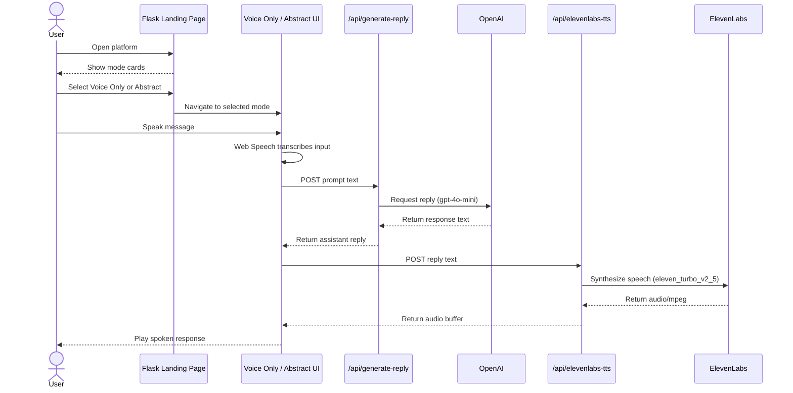
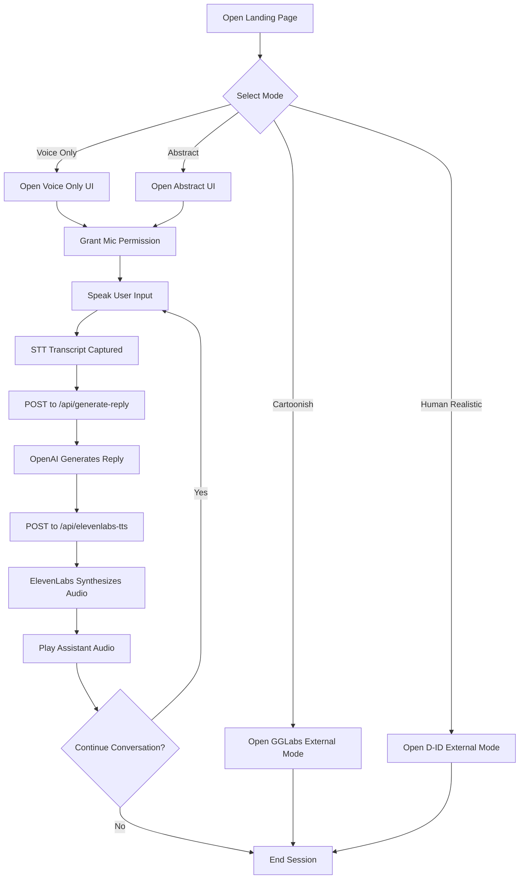

# Voice Emotion Bot Platform System Documentation

## 1. Introduction and Design Concept

### 1.1 System Overview

The Voice Emotion Bot Platform is a multi-experience, speech-first AI system that unifies multiple conversational interaction styles under one launcher. The platform is designed as a comparative product environment where users can move between minimal, abstract, cartoon-style, and human-realistic voice experiences while preserving a consistent conversational objective: real-time, empathetic, short-form spoken dialogue.

At runtime, the system is split into a launcher tier and experience tiers. The launcher is a lightweight Flask web app that routes users to either local Next.js applications or external hosted experiences.

The platform currently exposes four modes:

| Mode | Type | Location |
|---|---|---|
| Voice Only | Local Next.js app | `http://localhost:3000` |
| Abstract | Local Next.js app | `http://localhost:3001` |
| Cartoonish Mode | External hosted service | `https://gglabs.kikiz.ai/?mode=call` |
| Human Realistic Mode | External D-ID AI agent | D-ID Studio agent (GPT-4.1 powered) |

The two local applications (`Voice Only` and `Abstract`) are the primary repository-owned implementations and share the same AI service stack for conversational intelligence and speech synthesis.

Both local applications share exactly two AI service providers:

- **OpenAI** (`gpt-4o-mini`) for language model response generation.
- **ElevenLabs** (`eleven_turbo_v2_5`) for text-to-speech synthesis.

### 1.2 Platform Purpose and Design Intent

The platform is engineered to address a practical product gap: text chat interfaces are often too slow, too mechanical, and emotionally low-bandwidth for conversational support experiences. The design intent is to minimize interaction friction and maximize perceived responsiveness through voice input, short empathetic replies, and clear visual state feedback.

Primary design intent:

- Enable natural spoken interaction with low cognitive overhead.
- Keep model outputs concise and emotionally supportive.
- Separate experience aesthetics (UI style) from conversation engine behavior.
- Keep provider credentials server-side and never expose secrets to the browser.

### 1.3 Problem Statement

Conventional chatbot interfaces create three common user-experience issues:

- **Input friction**: typing slows interactions and interrupts emotional flow.
- **Feedback uncertainty**: users cannot always tell if the system is listening, thinking, or speaking.
- **Emotional flatness**: long, generic responses can reduce perceived empathy and conversational quality.

This platform addresses these issues through:

- browser-native speech capture,
- explicit phase signaling (`listening`, `processing`, `speaking`),
- short, empathetic, context-preserving responses,
- spoken output via a consistent voice profile.

This is especially relevant for use cases such as:

- emotionally aware AI companion interfaces,
- voice-based support assistants,
- multimodal conversational UI experiments,
- interactive demos that compare multiple voice bot interaction styles.

### 1.4 Core Design Concept

The product concept is built on three interacting principles:

1. **Centralized entry point**
   A single launcher provides discoverability and fast switching across experiences.

2. **Variant-based experience design**
   Multiple interfaces implement the same core speech loop, enabling side-by-side UX evaluation without changing the provider stack.

3. **Speech-to-speech conversational loop**
   The platform is fundamentally voice-native and organized around this lifecycle:

   `user speech -> transcription -> language model response -> speech synthesis -> next turn`

### 1.5 Experience Strategy

The project intentionally offers four experiences with distinct design philosophies:

- **Voice Only** is minimal, stripped down, and interaction-efficient. It emphasizes utility and low interface complexity — a centered voice bar, circular mic button, and placeholder state text.
- **Abstract** is experiential, visual, and immersive. A 3D reactive ball (GlowSphere) is the primary interface — it pulses and scales in real time based on the user's voice audio intensity, growing when the user speaks loudly and shrinking during silence. The orb responds to every phase of the conversation visually.
- **Cartoonish Mode** is an externally hosted avatar service powered by GGLabs, accessed at `https://gglabs.kikiz.ai/?mode=call`.
- **Human Realistic Mode** is a D-ID AI video agent configured in D-ID Studio with GPT-4.1 as the underlying language model.

This four-mode structure makes the platform a comparative framework for voice UX patterns as well as a multi-mode product demo.

### 1.6 Design Principles

The current implementation reflects these practical design principles:

- **Low-friction entry**: users can start from a landing page and quickly open any of the four experiences.
- **Browser-first capture**: microphone capture and speech recognition are handled in the browser via Web Speech API.
- **Short empathetic responses**: the LLM is configured for brief, warm replies — under 30 seconds of speech — using `LLM_MAX_TOKENS=<your_key>`.
- **Single-provider clarity**: exactly one LLM (OpenAI) and one TTS provider (ElevenLabs) are active. No provider switching.
- **Secrets server-side only**: all external provider calls go through Next.js server-side route handlers. API keys are never exposed to the browser.

### 1.7 Scope and Boundaries

In-scope repository capabilities:

- A Flask launcher application.
- A minimal Next.js voice UI (`Voice Only`).
- An immersive 3D Next.js voice UI (`Abstract`) with audio-reactive GlowSphere.
- Server-side API routes for OpenAI LLM and ElevenLabs TTS orchestration.
- Client-side Web Speech API recognition and audio intensity analysis.
- Two external hosted experiences (Cartoonish Mode via GGLabs, Human Realistic Mode via D-ID) linked from the landing page.

Out-of-scope in this repository:

- Source-level ownership of the external GGLabs and D-ID experiences.
- Multi-provider orchestration beyond OpenAI and ElevenLabs.
- Full production-grade deployment orchestration (this repository is optimized for local development and demonstration flows).

---

## 2. Design Framework

### 2.1 High-Level Framework

The system uses a layered architecture with strict separation of concerns between presentation, interaction control, service orchestration, and external providers.

#### Presentation Layer

This layer is responsible for user-facing interaction and includes:

- the Flask landing page,
- the `Voice Only` Next.js interface,
- the `Abstract` Next.js interface,
- browser-side controls for microphone, playback, and live status display,
- visual feedback such as placeholders, speaking/listening states, transcripts, and animated 3D objects.

#### Interaction Control Layer

This layer coordinates session state and user turn-taking:

- listening state,
- processing state,
- speaking state,
- transition between turns,
- silence handling,
- transcript accumulation,
- response timing and latency display.

#### Service Orchestration Layer

This layer sits mainly in Next.js API routes and wraps external services:

- Text generation via OpenAI only (`/api/generate-reply`).
- Text-to-speech via ElevenLabs only (`/api/elevenlabs-tts`).
- Health checking of OpenAI and ElevenLabs connectivity (`/api/health`).

#### External Service Layer

This layer includes all third-party or separately running systems:

- **OpenAI** (`gpt-4o-mini`) — language model inference for both local apps.
- **ElevenLabs** (`eleven_turbo_v2_5`) — speech synthesis for both local apps.
- **GGLabs** — Cartoonish Mode (externally hosted, no local integration).
- **D-ID Studio** — Human Realistic Mode (externally hosted, GPT-4.1 powered, no local integration).

### 2.2 Functional Responsibility Matrix

| Concern | Browser Client | Next.js API Routes | External Service |
|---|---|---|---|
| Speech capture | Yes | No | No |
| Transcript handling | Yes | No | No |
| Prompt packaging | Yes | No | No |
| LLM invocation | No | Yes | OpenAI |
| TTS invocation | No | Yes | ElevenLabs |
| Secret management | No | Yes | No |
| Health diagnostics | Partial display | Yes | OpenAI/ElevenLabs endpoints |

### 2.3 Framework Style

The implementation is a hybrid of the following architecture styles:

- **Portal architecture** at the repository root through the Flask landing page.
- **Single-page application behavior** inside each Next.js voice experience.
- **Service adapter pattern** in the `lib/` layer and `app/api/` routes.
- **Event-driven interaction model** using browser speech events and microphone analysis.
- **Proxy-mediated external access** where browser clients never call OpenAI or ElevenLabs directly.

### 2.4 Design Framework Objectives

The framework is optimized for these engineering outcomes:

- Rapid experimentation across voice UX styles.
- Deterministic provider behavior (OpenAI + ElevenLabs only).
- Fast local setup for demo and research workflows.
- High visibility of system state during conversation turns.
- Maintainable component boundaries for iterative enhancement.

### 2.5 Technology Framework

| Concern | Technology |
|---|---|
| Landing page server | Flask 2.3.2 + Gunicorn |
| Voice application framework | Next.js 14 App Router |
| UI runtime | React 18 + TypeScript |
| Styling | Tailwind CSS |
| 3D visualization | Three.js / React Three Fiber / @react-three/postprocessing |
| Speech recognition | Browser Web Speech API |
| Language model | OpenAI gpt-4o-mini |
| Speech synthesis | ElevenLabs eleven_turbo_v2_5 |

### 2.6 Reliability Framework

The reliability strategy combines route-level resiliency and client-level graceful handling:

- OpenAI Chat Completions is the primary LLM call; on failure, the route retries with the OpenAI Responses API as a secondary path.
- If both OpenAI paths fail, the server returns an HTTP 500 and the client-side `generateReply` function displays a local canned empathetic phrase.
- ElevenLabs TTS has no fallback — if synthesis fails, the user sees an error state and the session can be restarted.
- The health route pre-checks both `OPENAI_API_KEY` and `ELEVENLABS_API_KEY` so credential issues are surfaced before a session begins.

### 2.7 Non-Functional Expectations

The design supports the following non-functional goals:

- **Security**: API keys remain server-side and are not leaked to browser clients.
- **Responsiveness**: interim transcripts and phase-state indicators provide immediate user feedback.
- **Observability**: health endpoint verifies external dependency readiness.
- **Extensibility**: both local experiences share API patterns, enabling future consolidation into common packages.

---

## 3. System Design

### 3.1 Top-Level System Composition

The deployed runtime topology consists of one launcher process, two local conversational applications, and two external conversational services.

Repository-owned executable segments:

1. **Flask launcher application**
   Located at the repository root. This serves `templates/index.html` and exposes links to the available voice modes.

2. **Voice Only application**
   A Next.js application focused on a minimal voice-only conversation interface.

3. **Abstract application**
   A richer Next.js application with a full-screen 3D audio-reactive GlowSphere, continuous transcripts, phase-managed conversation state, and ElevenLabs TTS speech output.

Externally hosted segments:

4. **Cartoonish Mode (GGLabs)**
   Linked from launcher; externally operated.

5. **Human Realistic Mode (D-ID Studio, GPT-4.1)**
   Linked from launcher; externally operated.

### 3.2 Root Launcher Design

The root `app.py` is intentionally simple. It has one responsibility: expose a landing route and provide URLs for downstream experiences.

Its design responsibilities are:

- serve the homepage,
- pass configured destination URLs into the Jinja template,
- act as the integration shell for multiple experiences,
- remain independent from the internal logic of the Next.js applications.

This is a sound design choice because the landing page does not need to know how speech recognition, AI inference, or TTS work. It only needs to route users into those systems.

### 3.3 Local Voice Application Boundary

Both local Next.js apps follow the same boundary model:

- `app/`: route definitions and page composition.
- `components/`: interaction and visualization components.
- `lib/`: browser-side service adapters.
- `app/api/`: server-side integration points that hold secrets.

This boundary ensures that credential-bearing operations never execute on the client.

### 3.4 Landing Page Design

The landing page is implemented in `templates/index.html` with inline CSS. Its design is a glossy card-based selector UI with:

- a soft gradient background,
- glassmorphism-inspired central card,
- selectable experience cards,
- responsive layout behavior,
- an intentionally demo-oriented visual tone.

The landing page is therefore not only a navigation page. It also acts as a product framing interface that presents the system as a unified platform.

### 3.5 Voice Only System Design

The `Voice Only` application is designed as the lean interaction path.

Its defining properties are:

- minimal visual clutter,
- voice input driven by `WebSpeechSTTClient`,
- silence-based utterance completion handling,
- server-side text generation via `/api/generate-reply`,
- speech output via an ElevenLabs-backed route,
- simple UI state transitions using placeholder text.

This application is best understood as the shortest practical pipeline from voice input to voice response.

### 3.6 Abstract System Design

The `Abstract` application is the immersive path. Its defining properties are:

- Session auto-starts on component mount — no tap-to-start required.
- Full-screen Three.js canvas as the primary interface.
- A `GlowSphere` component renders a reactive 3D orb. The orb scales up in real time when the user speaks loudly (high audio intensity) and shrinks during silence, using `AudioProcessor` for continuous amplitude tracking.
- Bloom and brightness post-processing (via `@react-three/postprocessing`) shift with conversation phase — brighter during listening and speaking, dimmer during idle.
- Continuous transcript display alongside the orb.
- LLM response generated server-side via `/api/generate-reply` (OpenAI only).
- Speech synthesis server-side via `/api/elevenlabs-tts` (ElevenLabs only), streamed as audio/mpeg and decoded in the browser `AudioContext`.
- Health diagnostics route confirms both service keys are valid.

Its design is closer to an ambient digital presence than a plain voice widget.

### 3.7 Data and Control Path Design

For both local applications, conversation control follows a deterministic request chain:

1. Browser captures speech and emits transcript.
2. Client posts transcript to `/api/generate-reply`.
3. Server route calls OpenAI and returns response text.
4. Client posts response text to `/api/elevenlabs-tts`.
5. Server route calls ElevenLabs and returns audio bytes.
6. Browser decodes/plays audio and returns to listening.

This design avoids direct third-party provider calls from the browser and centralizes API policy in route handlers.

### 3.8 Design Strengths and Current Constraints

Design strengths:

- Clear separation between UI logic and provider logic.
- Consistent provider contract across local experiences.
- Strong UX signaling through explicit phase states.
- Immersive visualization in `Abstract` without altering backend architecture.

Current constraints:

- Duplicated route logic between `Voice Only` and `Abstract` can increase maintenance cost.
- External mode behavior (GGLabs, D-ID) is outside repository-level governance.
- Deployment posture is demo/local-first rather than centralized production orchestration.

### 3.6 Internal System Boundaries

Within each Next.js application, responsibilities are split across:

- `app/` for route definitions and page composition,
- `components/` for UI and visualization,
- `lib/` for service adapters and client abstractions,
- `app/api/` for secure server-side external API communication.

This separation is appropriate because:

- browser-only code stays in client components or browser-side service classes,
- secret-bearing provider calls remain server-side in route handlers,
- UI concerns remain separated from network provider concerns.

### 3.7 Current Design Maturity

The system is production-ready at the prototype level.

Production-oriented aspects:

- Server-side API wrappers protect all provider secrets.
- Health-check route validates credentials before session start.
- Single-provider configuration (OpenAI + ElevenLabs) removes ambiguity.
- Consistent interaction loop tested across both local apps.

Areas for future consolidation:

- `Voice Only` and `Abstract` duplicate route logic that could be shared.
- External modes (Cartoonish, Human Realistic) are not version-controlled in this repository.
- The repository is structured for local development rather than containerized deployment.

---

## 4. User Flow and System Technical Architecture

### 4.1 End-to-End User Flow

The primary user flow starts from the launcher and branches into a selected voice experience.

#### Flow A: Platform Entry

1. User opens the Flask landing page.
2. The landing page displays multiple voice experience cards.
3. The user selects one mode.
4. The browser navigates to the selected local or external experience.

#### Flow B: Voice Only Interaction

1. User opens the Voice Only app.
2. User presses the microphone button.
3. Browser requests microphone permission.
4. Web Speech API begins listening.
5. Interim transcripts are displayed in real time.
6. After 2 seconds of silence following a final transcript, the utterance is treated as complete.
7. Final transcript is posted to `/api/generate-reply`.
8. Next.js server calls OpenAI gpt-4o-mini with the empathetic system prompt.
9. Response text is returned to the browser.
10. Browser posts response text to `/api/elevenlabs-tts`.
11. Next.js server calls ElevenLabs and returns audio/mpeg.
12. Browser decodes and plays the audio.
13. UI returns to ready state.

#### Flow C: Abstract Interaction

1. User opens the Abstract app.
2. Session starts automatically on component mount.
3. Browser microphone access is requested.
4. Microphone stream is connected to both Web Speech recognition and `AudioProcessor`.
5. `AudioProcessor` samples audio intensity each animation frame — the GlowSphere orb pulses and scales live with the user's voice amplitude.
6. User speaks — the orb grows visually as voice intensity increases.
7. Interim transcripts appear on screen.
8. Final transcript triggers the `processing` phase.
9. Browser posts prompt to `/api/generate-reply`.
10. OpenAI returns a short empathetic reply.
11. Browser posts reply text to `/api/elevenlabs-tts`.
12. ElevenLabs returns synthesized audio/mpeg.
13. Browser decodes and plays the audio. The orb reflects the `speaking` phase visually.
14. Recognition restarts for the next turn.

#### Flow D: Cartoonish Mode

1. User clicks Cartoonish Mode on the landing page.
2. Browser navigates to `https://gglabs.kikiz.ai/?mode=call`.
3. All interaction is managed by the GGLabs external platform.

#### Flow E: Human Realistic Mode

1. User clicks Human Realistic on the landing page.
2. Browser navigates to the D-ID agent share URL.
3. The D-ID agent uses GPT-4.1 as its language model.
4. All interaction is managed by D-ID Studio.

### 4.2 User Interaction Diagram



### 4.3 Technical Architecture Overview

```mermaid
flowchart TD
    A[User Browser] --> B[Flask Landing Page\nport 5000]

    B --> C[Voice Only\nNext.js — port 3000]
    B --> D[Abstract\nNext.js — port 3001]
    B --> E[Cartoonish Mode\ngglabs.kikiz.ai]
    B --> F[Human Realistic Mode\nD-ID Studio — GPT-4.1]

    C --> G[Web Speech API\nbrowser-native STT]
    C --> H[/api/generate-reply\nserver-side]
    C --> I[/api/elevenlabs-tts\nserver-side]

    D --> J[Web Speech API\nbrowser-native STT]
    D --> K[AudioProcessor\naudio intensity]
    D --> L[GlowSphere\n3D reactive orb]
    D --> M[/api/generate-reply\nserver-side]
    D --> N[/api/elevenlabs-tts\nserver-side]
    D --> O[/api/health\nserver-side]

    H --> P[OpenAI\ngpt-4o-mini]
    M --> P

    I --> Q[ElevenLabs\neleven_turbo_v2_5]
    N --> Q

    K --> L
```

### 4.4 Architectural Roles of the Main Processes

#### Browser Client

The browser handles:

- microphone permission and capture,
- Web Speech recognition,
- UI state transitions,
- transcript rendering,
- audio visualization,
- audio playback of generated responses.

#### Next.js API Layer

The Next.js route handlers handle:

- secure provider access using server-side environment variables,
- OpenAI request orchestration (Chat Completions with Responses API retry),
- TTS token acquisition and synthesis,
- health checking,
- response packaging back to the browser.

#### External AI Services

External services handle:

- language model inference,
- speech synthesis,
- optional transcription pathways.

### 4.5 User Interaction States

The system uses a phase-based interaction model.

In `Voice Only` the user-visible states are simplified to:

- ready,
- listening,
- thinking,
- speaking.

In `Abstract` the state model is explicit:

- `idle`,
- `listening`,
- `processing`,
- `speaking`.

This explicit state model is important because it allows the UI to synchronize:

- transcript updates,
- orb animation,
- brightness and bloom effects,
- provider activity,
- reconnection behavior.

### 4.6 Data Flow Characteristics

The main data flows in the system are:

- **Audio in**: browser microphone stream.
- **Speech text out of STT**: partial and final transcript strings.
- **Prompt payload**: JSON posted to `generate-reply` route.
- **LLM response text**: concise empathetic answer.
- **TTS request payload**: response text plus voice parameters.
- **Audio out**: synthesized audio binary streamed back to browser.

### 4.7 Technical Architecture Strengths

The current architecture has several strong traits:

- good separation between UI, provider wrappers, and external services,
- support for multiple provider combinations,
- ability to compare two voice UX models side by side,
- environment-variable-driven service configuration,
- browser-native speech capture for faster prototyping.

### 4.8 Technical Architecture Limitations

The current architecture also has real constraints:

- browser speech recognition support depends on browser capabilities,
- duplicated logic exists between `Voice Only` and `Abstract`,
- some provider integrations are incomplete,
- the root Flask app and Next.js apps are separate processes and must be run independently,
- orchestration is local-development oriented rather than containerized or fully centralized.

### 4.9 Practical User Interaction Guide (How to Use)

This subsection describes exactly how an end user should interact with the platform during a normal session.

#### Step 1: Open the Platform

1. Open the landing page in the browser.
2. Select one mode based on preferred experience style:
   - `Voice Only` for a minimal interface.
   - `Abstract` for immersive visual feedback.
   - `Cartoonish Mode` for external cartoon avatar interaction.
   - `Human Realistic Mode` for external D-ID agent interaction.

#### Step 2: Grant Microphone Access

1. On first use, the browser prompts for microphone permission.
2. Choose **Allow** to start speech interaction.
3. Confirm microphone icon in browser is active.

If microphone access is denied, speech interaction cannot begin.

#### Step 3: Speak Naturally

1. Speak one clear sentence at a time.
2. Pause briefly after speaking.
3. Wait while the system transitions from `listening` to `processing`.

Interaction tips:

- Keep input concise for faster turn completion.
- Avoid overlapping speech while assistant audio is playing.
- Use normal speaking tone; shouting is unnecessary.

#### Step 4: Listen to Assistant Response

1. The system sends your transcript to OpenAI.
2. The returned response text is sent to ElevenLabs.
3. Audio is played back in the browser.
4. When playback ends, the interface returns to the next listening cycle.

#### Step 5: Continue Multi-Turn Conversation

Repeat the same cycle:

`Speak -> Pause -> Listen -> Respond`

The conversation can continue indefinitely until the user closes the session.

#### Mode-Specific Interaction Notes

| Mode | User Behavior | Visible Feedback |
|---|---|---|
| Voice Only | Press mic and speak in short turns | transcript + ready/listening/thinking/speaking states |
| Abstract | Speak directly after auto-start | live orb pulse/scale + transcript + phase transitions |
| Cartoonish Mode | Interact according to external UI controls | managed by GGLabs experience |
| Human Realistic Mode | Interact according to D-ID agent controls | managed by D-ID video agent experience |

### 4.10 User Interaction State Diagram



---

## 5. System Implementation: Design Material

### 5.1 Visual Design Material

The system uses intentionally different visual grammars to validate how interface style changes perceived conversational quality while preserving the same AI core.

#### Flask Landing Page Design Material

The landing page uses:

- soft radial gradients,
- white translucent cards,
- rounded corners,
- subtle elevation shadows,
- gradient text for emphasis,
- product-selector style card layout.

This design signals accessibility and variety. It works well for a mode chooser because the UI communicates that the user is entering a family of related experiences.

#### Voice Only Design Material

The `Voice Only` interface uses:

- white background,
- centered voice bar,
- circular controls,
- placeholder-based state messaging,
- very low cognitive load.

This design reduces the interface to the minimum required for voice-first interaction.

Design objective:

- Reduce visual competition with speech interaction.
- Maximize input clarity and focus on turn-taking.

#### Abstract Design Material

The `Abstract` interface uses:

- full-screen canvas,
- white visual field with luminous 3D orb,
- bloom and brightness postprocessing,
- animated geometric shader effects,
- system-state-driven visual behavior,
- transcript overlays and feedback text.

This design material positions the assistant as an ambient, reactive digital presence rather than a plain form field.

Design objective:

- Convert invisible voice processing states into visible, continuous motion feedback.
- Create a more emotive and immersive interaction atmosphere.

### 5.2 Motion and Feedback Material

Motion in the system is functional, not decorative.

Examples:

- orb scale changes with audio intensity,
- brightness and bloom rise when the user is speaking,
- state changes are reflected through text and animation,
- placeholder text changes indicate processing lifecycle.

This is important in speech systems because the user needs immediate confirmation that the system is hearing, thinking, or speaking.

Feedback channels by phase:

| Phase | Primary Feedback | Secondary Feedback |
|---|---|---|
| Listening | Live transcript updates | Orb growth / UI label |
| Processing | State text | Orb normalization |
| Speaking | Audio playback | Orb brightness/bloom change |
| Idle/Ready | Prompt text | Neutral visual state |

### 5.3 Audio Design Material

The system’s audio material includes:

- microphone capture through browser media APIs,
- interim transcript feedback through Web Speech,
- AI-generated spoken response through TTS backends,
- optional audio intensity analysis for visualization.

The `Abstract` app extends this by using audio not only as content, but also as a visualization driver.

Implementation characteristics:

- Audio playback is decoded in-browser through `AudioContext`.
- ElevenLabs route returns `audio/mpeg` bytes for deterministic client handling.
- The same configured voice ID is reused across sessions for consistent assistant identity.

### 5.4 Implementation Materials by Runtime

#### Python Runtime Material

The root app uses:

- `Flask==2.3.2`
- `gunicorn==20.1.0`

This runtime is intentionally small because it only needs to serve the landing page.

#### Node/TypeScript Runtime Material

The local voice applications use:

- Next.js 14,
- React 18,
- TypeScript,
- Tailwind CSS,
- Axios,
- Three.js-related packages for immersive graphics.

Runtime role split:

- Flask runtime: launcher and routing shell only.
- Next.js runtime: real-time interaction orchestration and provider proxy routes.

### 5.5 Configuration Material

The only environment variables required to run both local Next.js applications:

```env
# LLM — OpenAI only
OPENAI_API_KEY=<your_key>
LLM_MAX_TOKENS=<your_key>

# TTS — ElevenLabs only
ELEVENLABS_API_KEY=<your_key>
ELEVENLABS_VOICE_ID=4RZ84U1b4WCqpu57LvIq
```

There is no `LLM_PROVIDER` environment variable. OpenAI is always used — there is no provider switching.

Configuration governance guidelines:

- Store keys only in server-side `.env` files.
- Use distinct keys for development vs production environments.
- Validate key health through `/api/health` before demo or deployment sessions.

### 5.6 Implementation Materials by Folder

#### Root Folder

- launcher server,
- HTML template,
- static JS,
- Python dependencies.

#### `Voice Only`

- minimal client interface,
- Web Speech transcription,
- LLM route,
- ElevenLabs speech output path.

Typical interaction role: baseline experience for fast-turn conversational testing.

#### `Abstract`

- Immersive full-screen 3D UI.
- GlowSphere visualization engine (audio-reactive orb).
- Audio processor (amplitude-based intensity for orb animation).
- ElevenLabs TTS route and browser-side client.
- Health diagnostics (OpenAI + ElevenLabs key checks).

Typical interaction role: immersive experience for audio-reactive conversational presence.

### 5.7 Design Material Quality Assessment

The implementation materials show a system designed for iterative product experimentation. The codebase is not optimized primarily for enterprise packaging. It is optimized for:

- quickly testing voice interaction ideas,
- maintaining a deterministic two-provider stack,
- comparing UX models,
- evolving features independently.

That makes it a strong prototype or demo architecture and a good candidate for later consolidation.

---

## 6. Software Component

### 6.1 Component Inventory

Below is the main software component map for the repository.

| Component | Location | Responsibility |
| --- | --- | --- |
| Flask Launcher | `app.py` | Serves the root landing page; publishes destination URLs for all four modes |
| Landing Template | `templates/index.html` | Renders the four-mode selection interface |
| Landing JS | `static/main.js` | Hover interactivity for mode cards |
| Voice Only Page | `Voice Only/app/page.tsx` | Bootstraps the minimal voice interface |
| Voice Only Interface | `Voice Only/components/VoiceInterface.tsx` | Mic control, silence detection, LLM request, ElevenLabs playback |
| ElevenLabs TTS Client (Voice Only) | `Voice Only/components/VoiceInterface.tsx` (inline class) | POSTs text to `/api/elevenlabs-tts`, decodes and plays audio/mpeg |
| Abstract Page | `Abstract/app/page.tsx` | Bootstraps the immersive 3D interface |
| Abstract Interface | `Abstract/components/VoiceInterface.tsx` | Session lifecycle, phase management, audio intensity state, visualization driver |
| ElevenLabs TTS Client (Abstract) | `Abstract/lib/elevenlabs-tts.ts` | POSTs text to `/api/elevenlabs-tts`, manages AudioContext and playback |
| GlowSphere | `Abstract/components/GlowSphere.tsx` | Renders audio-reactive 3D orb via React Three Fiber; scales with audioIntensity prop |
| Shader Definitions | `Abstract/components/shaders.ts` | GLSL shader code for the orb surface |
| Audio Processor | `Abstract/lib/audio-processor.ts` | Reads AnalyserNode frequency data, computes normalized intensity per animation frame |
| Web Speech Client | `Voice Only/lib/web-speech-stt.ts`, `Abstract/lib/web-speech-stt.ts` | Wraps browser SpeechRecognition API |
| Text Generation Client | `Voice Only/lib/text-generation.ts`, `Abstract/lib/text-generation.ts` | POSTs prompts to `/api/generate-reply`; falls back to canned phrases on failure |
| Generate Reply Route | `Voice Only/app/api/generate-reply/route.ts`, `Abstract/app/api/generate-reply/route.ts` | Server-side: sends prompt to OpenAI gpt-4o-mini, returns reply text |
| ElevenLabs TTS Route | `Voice Only/app/api/elevenlabs-tts/route.ts`, `Abstract/app/api/elevenlabs-tts/route.ts` | Server-side: calls ElevenLabs API with configured voice, returns audio/mpeg |
| Health Route | `Voice Only/app/api/health/route.ts`, `Abstract/app/api/health/route.ts` | Checks OpenAI and ElevenLabs connectivity; returns JSON status |

### 6.2 Core Functional Components

#### Launcher Component

The launcher component is responsible for system discoverability. It is not computationally heavy, but architecturally important because it unifies the overall platform.

#### STT Component

The Web Speech client wraps `window.SpeechRecognition` / `window.webkitSpeechRecognition`. It provides:

- Continuous recognition mode.
- Interim transcript callbacks (live as the user speaks).
- Final transcript callbacks (when the STT engine commits a phrase).
- Error and end event handling.

This is the only active speech recognition path. No external STT provider (Deepgram, Whisper, iFLYTEK) is used.

#### Conversation Intelligence Component

The language model component is centralized in the `/api/generate-reply` route. OpenAI is the only provider. This prevents secret leakage to the browser and keeps all LLM logic in one server-side location.

#### TTS Components

Both applications use a single, consistent TTS path:

- The browser-side TTS client class posts `{ text }` to `/api/elevenlabs-tts`.
- The Next.js route handler reads `ELEVENLABS_API_KEY` and `ELEVENLABS_VOICE_ID` from the server environment.
- ElevenLabs `eleven_turbo_v2_5` synthesizes the audio as audio/mpeg.
- The browser decodes the audio buffer with `AudioContext.decodeAudioData()` and plays it via `AudioBufferSourceNode`.

The API key is handled exclusively server-side — it is never sent to the browser.

#### Visualization Component (Abstract only)

The `Abstract` application adds a `GlowSphere` — a 3D audio-reactive orb that gives the AI an ambient visual presence. The orb scales, blooms, and brightens in real time with the user's voice amplitude. It significantly improves perceived responsiveness without adding to the conversation logic.

### 6.3 Visualization Component (Abstract only)

`GlowSphere.tsx` renders a sphere mesh in a React Three Fiber `Canvas`. It receives:

- `audioIntensity` (0–1 float): drives sphere scale and shader uniforms.
- `phase`: determines visual state (idle / listening / processing / speaking).
- `brightness` and `bloom`: passed from VoiceInterface to `EffectComposer > Bloom`.

The sphere uses custom GLSL shaders from `shaders.ts` that animate the surface to create an organic, luminous appearance. The orb grows visually when the user is speaking and contracts during silence.

### 6.4 Supporting Components

Supporting components include:

- Environment configuration (`.env` key loading).
- Health diagnostics (pre-session key validation).
- Transcript display state (per-turn accumulation).
- Latency tracking (time from prompt post to response receipt).
- Silence detection timers (Voice Only 2-second rule; Abstract uses Web Speech `speechend`).

### 6.5 Component Coupling

Coupling is deliberately layered:

```
Browser UI Component
    ↓ calls
lib/ Service Client (e.g. ElevenLabsTTSClient)
    ↓ fetches
app/api/ Route Handler (secret-bearing, server-side)
    ↓ calls
External Provider (OpenAI / ElevenLabs)
```

This ensures no API key leaks to the browser and no UI concerns reach the route layer. The main structural weakness is duplication between `Voice Only` and `Abstract` — both apps have identical route files that could be shared via a common package.

### 6.6 Component Readiness Status

- **Stable and complete**: Flask launcher, Web Speech STT, `/api/generate-reply` (OpenAI), `/api/elevenlabs-tts`, Voice Only interaction loop, Abstract orb visualization and ElevenLabs playback.
- **Stable, externally managed**: Cartoonish Mode (GGLabs), Human Realistic Mode (D-ID Studio with GPT-4.1).

---

## 7. System Algorithm

### 7.1 Primary Conversation Algorithm

At the highest level, the platform is driven by a deterministic turn-based speech algorithm.

#### Core Conversation Algorithm

```text
1. Start session
2. Acquire microphone access
3. Listen for user speech
4. Convert speech to text
5. Detect end of utterance
6. Submit prompt to language model route
7. Receive short contextual response
8. Submit response text to ElevenLabs route
9. Convert response text to audio
10. Play audio response
11. Return to listening state
12. Repeat until session ends
```

Algorithmic properties:

- Single LLM provider path (OpenAI only).
- Single TTS provider path (ElevenLabs only).
- Explicit phase transitions for predictable UI behavior.

### 7.2 Launcher Algorithm

The launcher follows a very simple routing algorithm:

```text
1. Receive GET request for /
2. Construct URL dictionary
3. Render landing template with those URLs
4. User clicks a mode card
5. Browser navigates to selected endpoint
```

This is intentionally simple because the launcher is a platform gateway, not a conversation engine.

### 7.3 Speech Recognition Algorithm

#### Browser STT Algorithm

The Web Speech client follows this logic:

```text
1. Check browser support for SpeechRecognition
2. Request microphone access
3. Start continuous recognition
4. Emit interim transcript while user is speaking
5. Emit final transcript when recognition engine marks phrase complete
6. On error, notify UI and stop listening
7. On end, update listening state
```

This algorithm favors responsiveness because partial recognition results are available before the utterance is fully complete.

### 7.4 Turn Finalization Strategy

The local applications finalize user turns with two complementary approaches:

- **Voice Only**: timer-driven end-of-utterance (2-second silence window).
- **Abstract**: speech-end event with supplementary amplitude-based silence checks.

This dual strategy balances implementation simplicity in `Voice Only` with higher responsiveness and richer signal processing in `Abstract`.

### 7.5 Silence Detection Algorithm

The repository includes two silence-handling patterns.

#### Voice Only Silence Strategy

`Voice Only` uses a timer-based strategy:

```text
1. Receive transcript event
2. Store final transcript if marked final
3. Reset pending silence timeout
4. Wait 2 seconds
5. If no new result arrived and transcript exists, treat speech as complete
6. Stop listening and process prompt
```

This approach is simple and effective for a minimal interaction model.

#### Abstract Silence Strategy

`Abstract` includes an `AudioProcessor` with amplitude monitoring:

```text
1. Sample audio intensity periodically
2. Mark when actual speech has occurred
3. After speech begins, monitor for sustained low intensity
4. If silence exceeds configured duration, trigger end-of-input callback
```

In practice, `Abstract` relies on the native Web Speech `speechend` event to detect end of utterance. The `AudioProcessor` silence detection is available as a supplementary path.

### 7.6 Response Text Handling

After OpenAI returns the reply text, it is immediately posted to `/api/elevenlabs-tts`. There is no language detection step. ElevenLabs handles the configured voice for all replies regardless of language content.

### 7.7 Response Generation Algorithm

```text
1. Receive { prompt, systemPrompt } from browser
2. Read OPENAI_API_KEY and LLM_MAX_TOKENS from server environment
3. Build messages array with fixed empathetic system instruction
4. Call OpenAI /v1/chat/completions (primary path, model: gpt-4o-mini)
5. On success: return reply text
6. On Chat API failure: retry with OpenAI Responses API (secondary path)
7. On both failure: return HTTP 500
8. Browser client catch: display local canned fallback empathetic phrase
```

Note: There is no secondary LLM provider. Both paths are OpenAI — they differ only in API endpoint and payload structure.

### 7.8 ElevenLabs TTS Algorithm

Both `Voice Only` and `Abstract` use the same TTS algorithm:

```text
1. Browser POSTs { text } to /api/elevenlabs-tts
2. Server reads ELEVENLABS_API_KEY and ELEVENLABS_VOICE_ID from env
3. Server calls ElevenLabs API:
   - model_id: eleven_turbo_v2_5
   - stability: 0.3, similarity_boost: 0.6
4. ElevenLabs returns audio/mpeg bytes
5. Server returns raw bytes to browser as audio/mpeg response
6. Browser decodes with AudioContext.decodeAudioData()
7. Browser plays decoded buffer via AudioBufferSourceNode
8. After playback completes, UI transitions back to listening phase
```

The API key is handled exclusively on the server — it is never sent to the browser.

### 7.9 Visualization Algorithm

The `Abstract` orb visualization follows an audio-reactive algorithm:

```text
1. Read audio frequency data from analyser
2. Convert to intensity estimate using RMS-like calculation
3. Map system phase to visual phase number
4. Interpolate shader uniforms over time
5. Increase orb scale, brightness, and bloom during listening and audio activity
6. Reduce effects during idle state
7. Render continuously in animation frame loop
```

This algorithm is important because it turns invisible speech-system internals into visible feedback.

### 7.10 Health Check Algorithm

The health route confirms the two required service credentials:

```text
1. GET /api/health
2. Check OpenAI: call /v1/models with OPENAI_API_KEY
3. Check ElevenLabs: call /v1/voices with ELEVENLABS_API_KEY
4. Aggregate { openai: ok/error, elevenLabs: ok/error, timestamp }
5. Return JSON health report
```

This gives an operational pre-check entry point. If either check fails, the API key is missing or invalid and must be corrected in `.env` before running a session.

### 7.11 Overall Algorithmic Character

The system does not run any local ML models. All intelligence comes from API-based orchestration:

- Turn detection through silence timing and Web Speech events.
- Phase state management (idle / listening / processing / speaking) to synchronize UI, orb visualization, and service calls.
- Audio-intensity mapping from `AudioProcessor` to 3D GlowSphere visual parameters.
- Secure server-side proxy for all OpenAI and ElevenLabs calls.

The engineering challenge is real-time interaction orchestration at the browser level — not model training.

---

## Conclusion

This platform implements a four-mode voice AI experience sharing a Flask-based launcher.

The two local modes (`Voice Only` and `Abstract`) use identical provider configuration:

- **Language model**: OpenAI `gpt-4o-mini` only, via server-side `/api/generate-reply`.
- **Speech synthesis**: ElevenLabs `eleven_turbo_v2_5` only, via server-side `/api/elevenlabs-tts`.
- **Speech recognition**: Browser Web Speech API, client-side only.

The key architectural distinction between the two local modes is the visual layer:

- `Voice Only` is a minimal speech-first interface — centered voice bar, circular mic button, state text only.
- `Abstract` adds a full-screen 3D audio-reactive GlowSphere that pulses and scales in real time with the user's voice amplitude, with bloom post-processing tied to conversation phase.

The two external modes extend the platform into hosted avatar experiences:

- **Cartoonish Mode** — GGLabs hosted service at `https://gglabs.kikiz.ai/?mode=call`.
- **Human Realistic Mode** — D-ID Studio AI video agent powered by GPT-4.1.

Required `.env` keys for both local apps: `OPENAI_API_KEY`, `LLM_MAX_TOKENS`, `ELEVENLABS_API_KEY`, `ELEVENLABS_VOICE_ID`.